`tools/bench/crossterm.py` (`just bench-vs`) runs cross-terminal comparison suites against peer terminals (`kitty`,
`alacritty`, `ghostty`, `wezterm`, `foot`) on a local desktop. The harness pins configuration, font size, and grid
geometry across all terminals, measures throughput, latency, startup, and memory footprint over multiple rounds, and
generates comparative reports with per-suite charts. Architectural decisions governing the harness design and workload
choices are in [the benchmark design](../explanation/benchmarks.md); in-tree regression performance targets (Criterion)
are in [testing.md](testing.md#performance-benchmarks).

Figures from different machines do not compare directly: hardware, display pipelines, fonts, and latency instruments
differ across environments.

## Harness specification

### Comparison field

A run over the full field measures ghostty twice: its release and its tip. On Linux `nix develop .#bench` pins both, the
tip to the upstream commit in `dev/flake.lock`; on macOS the tip is passed as `--tool ghostty-tip=<path>`
(`just bench-vs-fetch-tip` prints the path). A full run refuses to start when either is missing; `--terminals` narrows
the field and lifts the requirement.

### Suites and workloads

| Suite         | Workload                                     | Metric               | Platforms    |
| ------------- | -------------------------------------------- | -------------------- | ------------ |
| `vtebench`    | Alacritty benchmark payloads                 | Drain time (ms)      | Linux, macOS |
| `termbench`   | Contour terminal benchmark                   | MB/s                 | Linux, macOS |
| `cat`         | Cat fixed-payload file (ASCII, Unicode, CSI) | Elapsed seconds      | Linux, macOS |
| `kittenbench` | Kitty benchmark harness                      | MB/s                 | Linux, macOS |
| `doom-fire`   | DOOM fire animation                          | Frames per second    | Linux, macOS |
| `startup`     | Launch until its first window is on screen   | Time to window (ms)  | Linux, macOS |
| `memory`      | Idle and flooded memory                      | PSS / footprint (MB) | Linux, macOS |
| `latency`     | External keystroke-to-pixel latency          | Latency (ms)         | Linux, macOS |

Not every suite runs everywhere: one with no implementation for the host platform reports itself skipped instead of
being absent from the report. Every suite runs on Linux and macOS when its required terminals and tools are installed.

#### Latency instrument

`latency` needs a different instrument on each platform, and the suite is skipped where that platform's one is missing:
`typometer` on macOS, `wl-latency` on Linux (`tools/bench/wl-latency/`, built by the `.#bench` shell). Both press a key
and poll the screen until the pixel the glyph lands on changes color; they differ in what they press and poll through,
Typometer through the OS event API and `wl-latency` through `zwp_virtual_keyboard_v1` and `zwlr_screencopy_manager_v1`.
The instrument that took a run's bars is named on the chart. `wl-latency` drives niri only: it refuses to inject unless
niri reports the window id it was given as focused, and a desktop that cannot name and focus a window by id skips the
leg instead.

`wl-latency` reads each screen state it waits for (the typed reference pattern, a cleared line, an empty cell before a
key) by polling until it appears or 2 s pass, and releases each key right after pressing it. A cell already painted over
before its key is waited out and counted as `covered_before_key` in the leg's JSON. A leg the instrument fails is
measured once more in a fresh window; each failed attempt's reason is appended to `<name>.latency-failed`, and the chart
quotes it.

#### Startup measurement

`startup` runs `sleep` as each terminal's child, times each launch until the platform reports the launch's first window,
then terminates the launch. On Linux the signal is niri's event stream announcing a window whose pid is in the launch's
process tree, which niri sends once the toplevel is mapped with its first buffer; on macOS it is the first on-screen
layer-0 window of the tree in `CGWindowListCopyWindowInfo`, polled every 4 ms, which shows the window is visible but not
that it has been drawn into. `RUNS` launches are timed after `WARMUP` discarded ones; a leg's value is their median, and
its within-leg spread is half their interquartile range. A launch that shows no window within 20 s ends the leg as a
recorded failure with no bar. On a tiler, work that delays the first configure is included, but completing the tiling
animation is not timed.

felis has two rows. **felis (cold)** stops the bench daemon before every launch, so each launch autospawns one. **felis
(warm)** starts with one untimed launch whose autospawned daemon every later launch reuses: stopping a launch terminates
its process tree except that daemon, which on macOS is a child of the client and so inside the tree. Before every launch
the cold row checks that no daemon is bound to the bench socket and the warm row that the same daemon still is; a launch
that fails its check ends the row as a recorded failure. Each row records in `daemon_checked` how many launches passed
their check.

### Resource accounting and sampling

The `memory` suite reads each platform's own accounting rather than RSS: PSS (`/proc/<pid>/smaps_rollup`) on Linux,
`phys_footprint` (`proc_pid_rusage`) on macOS. Each number is what the OS charges to the processes the suite samples
under its ledger: PSS is the process's proportional share of its resident pages, `phys_footprint` is the process's
physical-footprint ledger (the number Activity Monitor's Memory column shows). Whatever the GPU driver allocates and the
OS charges to the process is inside; whatever it holds elsewhere (device memory the process does not map, kernel-side
driver state) is outside, and how the split falls depends on the API, the driver and the GPU: a GPU terminal's bar
carries a driver share the reader cannot separate from the rest, while a CPU renderer (foot) carries none. The metric is
recorded per leg and named on the chart.

`vtebench`, `termbench`, `cat`, `kittenbench` and `doom-fire` also record what each terminal spent on the measured pass,
in `<name>.res.json` beside the suite's results (`tools/bench/usage.py`), charted as one CPU-time and one peak-memory
chart with a panel per suite. The wrapper touches `<name>.start` and waits for `<name>.started`, which the sampler
writes after its baseline reading; the window closes once the wrapper has touched `<name>.end` and the processes have
gone idle (under 5% of one core for a 0.25 s interval, at most 3 s after the marker). In between, the processes are
sampled every 0.25 s:

| Field     | Linux                                          | macOS                                                                                                          |
| --------- | ---------------------------------------------- | -------------------------------------------------------------------------------------------------------------- |
| `cpu_s`   | growth of `utime + stime` (`/proc/<pid>/stat`) | growth of `ri_user_time + ri_system_time` (`proc_pid_rusage` v4), Mach ticks converted by `mach_timebase_info` |
| `peak_kb` | largest PSS sample                             | largest `phys_footprint` sample                                                                                |
| `mean_kb` | mean PSS sample                                | mean `phys_footprint` sample                                                                                   |
| `wall_s`  | the window's wall time                         | the window's wall time                                                                                         |

felis is its client and its daemon, recorded separately under `parts` and summed sample by sample; every other terminal
is its launch process plus the children named after it or a listed helper (kitty's `kitten`). Work outside those
processes, such as a GPU driver's own threads or the compositor, is not counted. A leg whose sampling failed keeps its
throughput result and prints the reason.

### Window and grid pinning

The field runs at one grid, and felis's own window is that reference: it is the only terminal with no size flag, so
every other one is brought to it. Which party brings it there depends on the desktop, and the pin is selected by
detection:

| Desktop                                        | Mechanism                                                                                                                            | Verified                            |
| ---------------------------------------------- | ------------------------------------------------------------------------------------------------------------------------------------ | ----------------------------------- |
| Floating (macOS, GNOME, a floating compositor) | each terminal's own size flag; the harness places nothing                                                                            | cell grid                           |
| niri                                           | `niri msg action move-window-to-floating`, then `set-window-width` / `set-window-height` in logical pixels, iterated against the tty | cell grid and render area in pixels |

A leg the pin cannot place falls back to a tty pin (`stty rows cols`) so that every terminal still parses identical
bytes; it is recorded as `tty-only` in `grid-mismatch`, because the render area differs even where the cell grid
matches.

Each leg records `rows cols xpixel ypixel` from TIOCGWINSZ in `<name>.size`, and the reference is cached in the same
four fields as `<root>/grid`. Verification compares width and height separately against the reference, each within one
reference cell (`xpixel/cols`, `ypixel/rows`): padding is smaller than a cell, while a font pin that did not apply moves
the window by at least one. A terminal that leaves the pixel fields at zero is verified by cell count alone and its bar
carries `pixels unreported`. `GRID_ROWS` and `GRID_COLS` override the reference as a pair, and only a pin that can
resize accepts them.

### Rounds and reporting

The field is measured `ROUNDS` times (default 1, a publishable run 3). A round runs every leg once, and the leg order
rotates by one per round so that no terminal keeps a position; the order a round ran in is recorded beside its artifacts
as `order`. One round writes each leg's artifacts directly under `<root>/<suite>/`, two or more write them under
`<root>/<suite>/round-<n>/`. Resume markers are per `(round, terminal)`, so a crashed multi-round run continues where it
stopped; resuming a root under a different `ROUNDS` than it was measured with is refused before the first window opens.

A bar is the median of that terminal's per-round values and its whisker their min-max range. A bar from fewer than two
rounds carries no whisker and states the count it has ("1/3 rounds"); a single-round chart draws the within-leg spread
instead. Each chart's subtitle names the whisker it drew, and the table prints range, within-leg spread and round count
together. The `felis vs best other` column prints a ratio only where the run supports one: `—` when either side measured
fewer than two rounds, and `—` when the two ranges overlap.

Each leg records the machine it ran on at both ends of itself, in `<name>.env.json`: the one-minute load average on
every platform, plus the `pmset -g therm` speed limit on macOS and the `/sys/devices/system/cpu/*/thermal_throttle/`
counters on Linux, recorded as `unavailable` where the platform reports neither. A chart note names the legs whose load
average ran more than 1.0 above the load `meta.json` recorded when the run started, and the legs the platform called
throttled: on Linux a counter that advanced across the leg, on macOS a speed limit below 100 at either end of it.

The same record carries `display`, whether a window could present a frame, as `locked` and `asleep` (`true`, `false`, or
`null` for unknown):

| Field    | macOS                                                              | Linux                                             |
| -------- | ------------------------------------------------------------------ | ------------------------------------------------- |
| `locked` | `IOConsoleLocked` from `ioreg -a -n Root -d1`                      | logind's `LockedHint` on `seat0`'s active session |
| `asleep` | `CGDisplayIsAsleep` for the main display, read through `osascript` | `null`: no reading is taken                       |

A leg sampled with either field `true` is refused: at its start the leg is not launched, and at its end it is stopped as
usual. `<name>.env.json` records the reason under `refused`, and the console prints it. Every other artifact of the
attempt, its resume marker included, lands in `refused/` beside the suite's results, where the report does not read it;
the chart note names the leg, and a resumed run retakes it.

#### Leg attempts

Each attempt at a leg writes every artifact, its own and the harness's records of it, into a fresh directory under
`.attempts/` in the suite (or round) directory, and the report reads none of them there. Starting an attempt deletes the
artifacts an earlier attempt of the same leg left in the suite directory, except `<name>.latency-failed`, which the
harness appends across attempts. When a leg ends, after its end-of-leg environment sample and before its processes are
stopped, the attempt's files are copied into a sealed directory, which holds every later record the harness writes for
the attempt; a suite that runs no process that writes there (`startup`) is sealed when the attempt returns. An attempt
that returns is promoted: its sealed directory is renamed to `.attempts/<name>.promoting` as the commit, and its files
are then moved into the suite directory, the resume marker last. An attempt that returns without its resume marker
(`<name>.done`; `<name>.mem.json` in `memory`) lands only its env record in the suite directory, and every other file in
`unfinished/`, which the report does not read. An attempt that raises or is interrupted is discarded. Before a suite
starts, a committed promotion is finished and every other attempt directory is deleted; before the report reads a
directory, committed promotions are finished.

Stopping a leg sends SIGTERM to the launch and every process under it, and to felis's daemon and every process under it.
The tree is walked before the first signal and again every 50 ms while waiting; a process that remains after 5 s gets
SIGKILL, and one still alive after that is printed as `LINGERING`. Each process is held by its identity from the moment
it is found: the launch through the harness's own `Popen`, any other process through a pidfd on Linux and through its
start time from `proc_pid_rusage`, compared again before each signal, on macOS. A child is held only after it is
confirmed to still be its parent's child while the parent is alive. `startup` stops each launch the same way, sparing
the warm daemon, and stops the bench daemon between cold launches with SIGTERM alone.

For workload parameter overrides and prerequisites, see `python3 tools/bench/crossterm.py --help`.

### Environment variables

| Variable             | Read by                                  | Effect                                                                                                                                              |
| -------------------- | ---------------------------------------- | --------------------------------------------------------------------------------------------------------------------------------------------------- |
| `FELIS_BENCH_<TOOL>` | `tools/bench/crossterm.py`               | Absolute path to one pinned comparison binary (`FELIS_BENCH_KITTY`, `FELIS_BENCH_GHOSTTY`, …), overriding what the field resolves.                  |
| `FELIS_BENCH_SHELL`  | `tools/bench/crossterm.py`, `envinfo.py` | Marks the run as inside `nix develop .#bench`. Absent, the run warns that its field came from the host `PATH`, and records the fact in `meta.json`. |

## macOS

felis at 0.1.0 on an Apple M4 Max.

### Run conditions

| Item      | Value                                                                          |
| --------- | ------------------------------------------------------------------------------ |
| Date      | 2026-09-25                                                                     |
| Machine   | Apple M4 Max (12P + 4E cores, 40-core GPU), 128 GB, AC power                   |
| Display   | 3440x1440 @ 60 Hz, 1x scale                                                    |
| OS        | macOS 26.4.1 (25E253)                                                          |
| Window    | floating; 120x35 cells, Menlo 14 pt                                            |
| Rounds    | 3; leg order rotated per round                                                 |
| Workloads | the `crossterm.py` defaults (150 MB `cat` payloads, 200k-line flood, 200 keys) |

| Terminal    | Version               | Source                                           |
| ----------- | --------------------- | ------------------------------------------------ |
| felis       | 0.1.0                 | `nix build .#felis`                              |
| kitty       | 0.49.0                | `nix develop .#bench`                            |
| alacritty   | 0.17.0                | `nix develop .#bench`                            |
| wezterm     | 0-unstable-2026-08-31 | `nix develop .#bench`                            |
| ghostty     | 1.3.1                 | `nix develop .#bench` (upstream's release build) |
| ghostty-tip | 1.3.2-main+982fe90d9  | upstream `tip` pre-release (daily)               |

felis, kitty, alacritty and wezterm are Nix builds, so their compiler and optimization settings come from one packaging;
ghostty and ghostty-tip are upstream's own builds. Each value below is the median of the three rounds, and every leg
completed in every round. **Bold** marks the best value in a row.

### Throughput

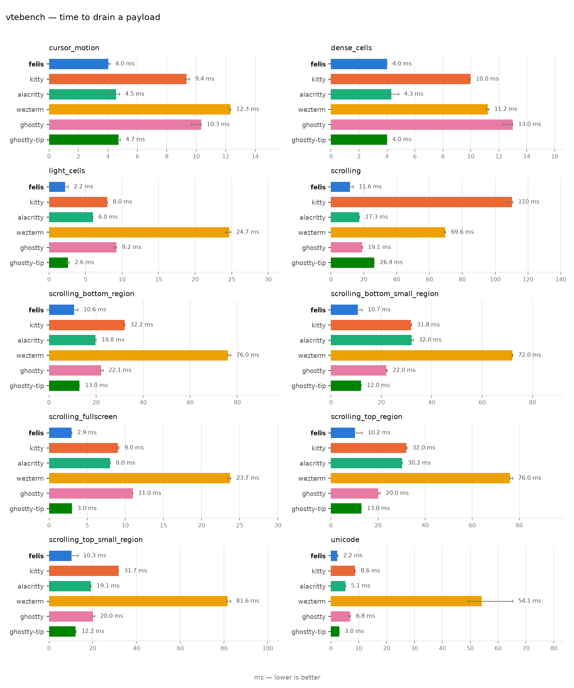

vtebench, milliseconds to drain a payload with the renderer live (lower is better):

| Benchmark                     | felis    | kitty | alacritty | wezterm | ghostty | ghostty-tip |
| ----------------------------- | -------- | ----- | --------- | ------- | ------- | ----------- |
| cursor_motion                 | **4.0**  | 9.4   | 4.5       | 12.3    | 10.3    | 4.7         |
| dense_cells                   | **4.0**  | 10.0  | 4.3       | 11.2    | 13.0    | **4.0**     |
| light_cells                   | **2.2**  | 8.0   | 6.0       | 24.7    | 9.2     | 2.6         |
| scrolling                     | **11.6** | 110   | 17.3      | 69.6    | 19.1    | 26.4        |
| scrolling_bottom_region       | **10.6** | 32.2  | 19.8      | 76.0    | 22.1    | 13.0        |
| scrolling_bottom_small_region | **10.7** | 31.8  | 32.0      | 72.0    | 22.0    | 12.0        |
| scrolling_fullscreen          | **2.9**  | 9.0   | 8.0       | 23.7    | 11.0    | 3.0         |
| scrolling_top_region          | **10.2** | 32.0  | 30.2      | 76.0    | 20.0    | 13.0        |
| scrolling_top_small_region    | **10.3** | 31.7  | 19.1      | 81.6    | 20.0    | 12.2        |
| unicode                       | **2.2**  | 8.6   | 5.1       | 54.1    | 6.8     | 3.0         |

felis and ghostty-tip tie on dense_cells. felis's range across rounds overlaps with ghostty-tip's on light_cells and on
the bottom_small, top and top_small region rows, so the lead on those four rows is not resolved.

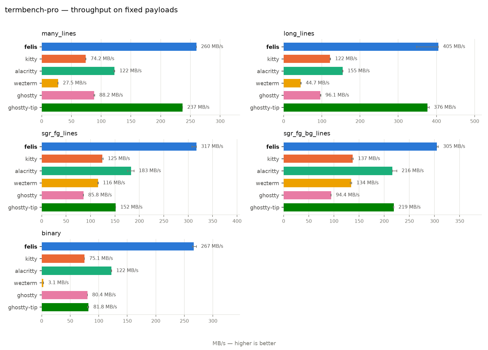

termbench-pro, MB/s (higher is better):

| Benchmark       | felis   | kitty | alacritty | wezterm | ghostty | ghostty-tip |
| --------------- | ------- | ----- | --------- | ------- | ------- | ----------- |
| many_lines      | **260** | 74.2  | 122       | 27.5    | 88.2    | 237         |
| long_lines      | **405** | 122   | 155       | 44.7    | 96.1    | 376         |
| sgr_fg_lines    | **317** | 125   | 183       | 116     | 85.8    | 152         |
| sgr_fg_bg_lines | **305** | 137   | 216       | 134     | 94.4    | 219         |
| binary          | **267** | 75.1  | 122       | 3.1     | 80.4    | 81.8        |

felis's long_lines ranged from 348 to 405 MB/s across rounds, which includes ghostty-tip's 376.

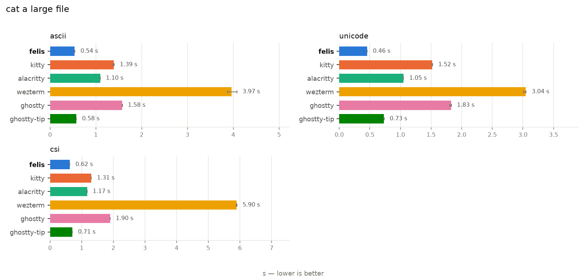

`cat` of a 150 MB file, seconds until `cat` returns (lower is better):

| Payload | felis    | kitty | alacritty | wezterm | ghostty | ghostty-tip |
| ------- | -------- | ----- | --------- | ------- | ------- | ----------- |
| ascii   | **0.54** | 1.39  | 1.10      | 3.97    | 1.58    | 0.58        |
| unicode | **0.46** | 1.52  | 1.05      | 3.04    | 1.83    | 0.73        |
| csi     | **0.62** | 1.31  | 1.17      | 5.90    | 1.90    | 0.71        |

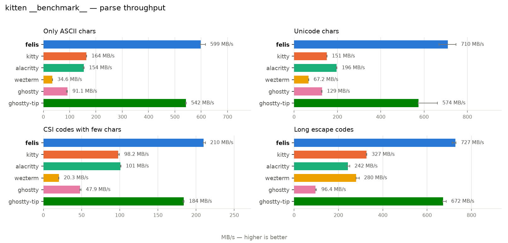

`kitten __benchmark__`, parse throughput with rendering suppressed, MB/s (higher is better):

| Benchmark                | felis   | kitty | alacritty | wezterm | ghostty | ghostty-tip |
| ------------------------ | ------- | ----- | --------- | ------- | ------- | ----------- |
| Only ASCII chars         | **599** | 164   | 154       | 34.6    | 91.1    | 542         |
| Unicode chars            | **710** | 151   | 196       | 67.2    | 129     | 574         |
| CSI codes with few chars | **210** | 98.2  | 101       | 20.3    | 47.9    | 184         |
| Long escape codes        | **727** | 327   | 242       | 280     | 96.4    | 672         |

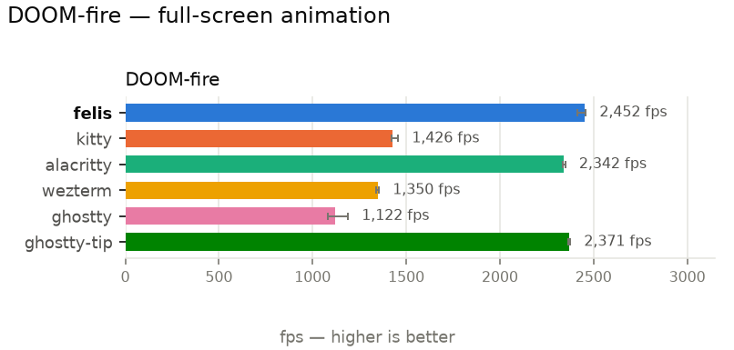

DOOM-fire, frames per second over 20 s, as counted by the program (higher is better):

| felis     | kitty | alacritty | wezterm | ghostty | ghostty-tip |
| --------- | ----- | --------- | ------- | ------- | ----------- |
| **2,452** | 1,426 | 2,342     | 1,350   | 1,122   | 2,371       |

The ghostty release trails its tip by 2.1 to 7.0 times on `cat`, `kitten __benchmark__` and DOOM-fire, and on most
vtebench and termbench-pro rows; on vtebench's scrolling row the release is the faster of the two. The tip's figures are
not what the release ships.

### Latency

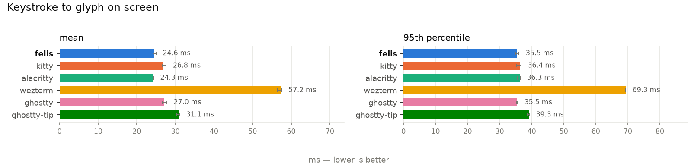

Keystroke to glyph on screen, measured with Typometer, 200 keys per round, in milliseconds (lower is better). The
figures include the compositor, the display and the instrument, so they compare terminals with each other and not with
zero.

| Statistic       | felis    | kitty | alacritty | wezterm | ghostty  | ghostty-tip |
| --------------- | -------- | ----- | --------- | ------- | -------- | ----------- |
| mean            | 24.6     | 26.8  | **24.3**  | 57.2    | 27.0     | 31.1        |
| 95th percentile | **35.5** | 36.4  | 36.3      | 69.3    | **35.5** | 39.3        |

felis's mean ranged from 24.3 to 25.0 ms across rounds and alacritty's from 24.3 to 24.4. On the 95th percentile the
felis, kitty, alacritty and ghostty ranges overlap. The order among them is not resolved.

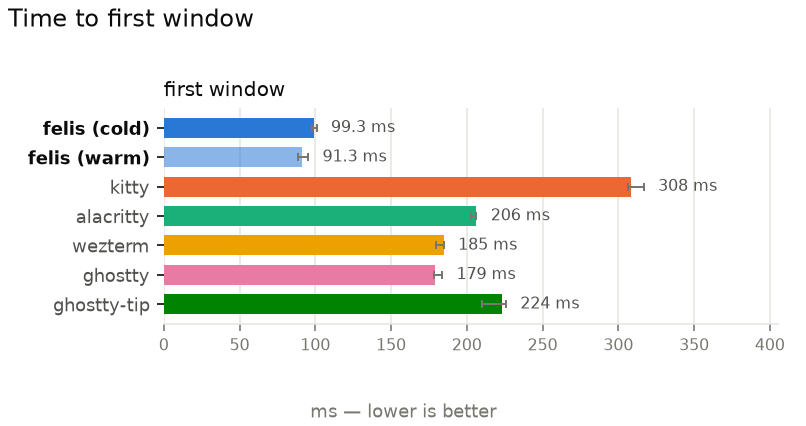

Time from launch to the first window, in milliseconds (lower is better). A window counts when it is ordered on screen,
which does not show that it has been drawn into. Each round is the median of 10 launches after 3 discarded ones.

| felis (cold) | felis (warm) | kitty | alacritty | wezterm | ghostty | ghostty-tip |
| ------------ | ------------ | ----- | --------- | ------- | ------- | ----------- |
| 99.3         | **91.3**     | 308   | 206       | 185     | 179     | 224         |

felis (cold) starts its daemon on every launch; felis (warm) reuses a running one. Warm was below cold in every round
(89 to 95 against 98 to 101).

### Memory

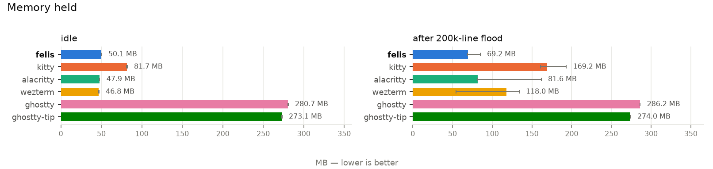

Physical footprint (`phys_footprint`, the Activity Monitor figure) summed over each terminal's processes, in MB (lower
is better):

| State                   | felis    | kitty | alacritty | wezterm  | ghostty | ghostty-tip |
| ----------------------- | -------- | ----- | --------- | -------- | ------- | ----------- |
| idle                    | 50.1     | 81.7  | 47.9      | **46.8** | 280.7   | 273.1       |
| after a 200k-line flood | **69.2** | 169.2 | 81.6      | 118.0    | 286.2   | 274.0       |

felis's figure is client plus daemon: 46.1 MB and 4.0 MB idle, 46.2 MB and 22.9 MB after the flood. The flood row varies
across rounds for felis (69 to 85 MB), alacritty (82 to 162 MB) and wezterm (55 to 134 MB), and the three ranges
overlap. ghostty's scrollback is capped by bytes, not lines, so its flood figure ran at its default cap rather than the
10,000 lines every other terminal was held to.

### Resource use under load

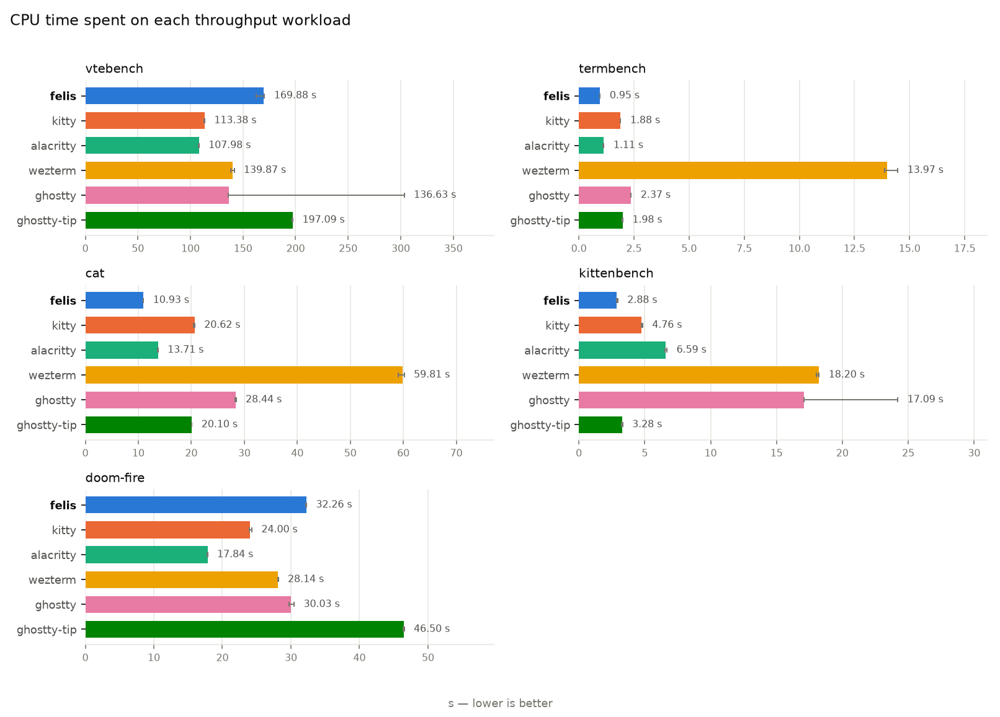

CPU time (`utime + stime`) the terminal's processes accrued over each workload's measured pass, in seconds (lower is
better). felis is its client and daemon summed.

| Workload    | felis    | kitty | alacritty | wezterm | ghostty | ghostty-tip |
| ----------- | -------- | ----- | --------- | ------- | ------- | ----------- |
| vtebench    | 170      | 113   | **108**   | 140     | 137     | 197         |
| termbench   | **0.95** | 1.88  | 1.11      | 14.0    | 2.37    | 1.98        |
| cat         | **10.9** | 20.6  | 13.7      | 59.8    | 28.4    | 20.1        |
| kittenbench | **2.88** | 4.76  | 6.59      | 18.2    | 17.1    | 3.28        |
| doom-fire   | 32.3     | 24.0  | **17.8**  | 28.1    | 30.0    | 46.5        |

Work that runs outside those processes is not counted: a GPU driver's own threads and the window server's compositing
are invisible here. The daemon accounts for 95% or more of felis's time in every workload. On vtebench and DOOM-fire,
felis used about 1.6 cores for the length of the pass, against alacritty's 0.9 to 1.0. The 200k-line flood of the memory
suite cost 0.05 to 0.13 s for every terminal.

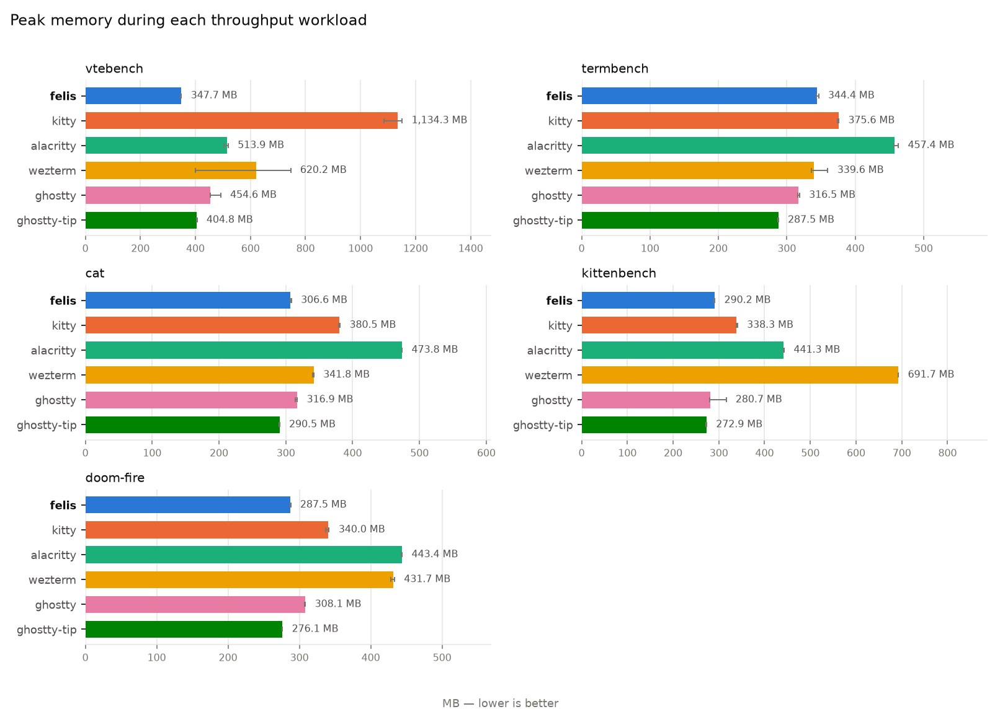

Peak physical footprint over each workload's measured pass, sampled every 0.25 s and summed over the terminal's
processes, in MB (lower is better).

| Workload    | felis | kitty   | alacritty | wezterm | ghostty | ghostty-tip |
| ----------- | ----- | ------- | --------- | ------- | ------- | ----------- |
| vtebench    | 347.7 | 1,134.3 | 513.9     | 620.2   | 454.6   | **404.8**   |
| termbench   | 344.4 | 375.6   | 457.4     | 339.6   | 316.5   | **287.5**   |
| cat         | 306.6 | 380.5   | 473.8     | 341.8   | 316.9   | **290.5**   |
| kittenbench | 290.2 | 338.3   | 441.3     | 691.7   | 280.7   | **272.9**   |
| doom-fire   | 287.5 | 340.0   | 443.4     | 431.7   | 308.1   | **276.1**   |

These peaks are taken while the terminal draws, and for felis, kitty, alacritty and wezterm they are 4 to 15 times the
idle figure of the memory section; ghostty's and ghostty-tip's are at most 1.6 times theirs. In felis the client
accounts for 280 to 305 MB of each peak and the daemon for 5 to 60 MB.

### Limits of this run

- Every terminal held the same 120x35 cell grid, but the cell sizes differ: felis draws 8x17 px cells (960x600 px),
  kitty 9x16 (1080x560), alacritty, ghostty and ghostty-tip 8x16 (960x560), and wezterm 8x17 (960x595). felis renders 1
  to 7% more pixels than every terminal but kitty, which renders 5% more than felis.
- ghostty-tip is a daily build and replaces itself at the same URL; the version string above identifies the build
  measured.

## Linux

felis at `0.1.0` on an Intel Core i5-12400F with an NVIDIA GeForce RTX 3080, under the niri compositor.

### Run conditions

| Item      | Value                                                                                           |
| --------- | ----------------------------------------------------------------------------------------------- |
| Date      | 2026-09-25                                                                                      |
| Machine   | Intel Core i5-12400F (6 cores, 12 threads), 62.6 GiB                                            |
| GPU       | NVIDIA GeForce RTX 3080, 12 GB, driver 595.104.02                                               |
| Display   | 3440x1440 @ 60 Hz, 1x scale                                                                     |
| OS        | NixOS 26.11, Linux 7.2.7-xanmod1, `intel_pstate` with the `powersave` governor                  |
| Window    | niri 26.04; the harness floats each window and sizes it to 106x35 cells, DejaVu Sans Mono 14 pt |
| Rounds    | 3; leg order rotated per round                                                                  |
| Workloads | the `crossterm.py` defaults (150 MB `cat` payloads, 200k-line flood, 200 keys)                  |

The machine also hosts a CI runner, which was stopped for the run, and a Windows CI virtual machine, which stayed up.

| Terminal    | Version               | Source                                                                         |
| ----------- | --------------------- | ------------------------------------------------------------------------------ |
| felis       | 0.1.0                 | `nix build .#felis`                                                            |
| kitty       | 0.49.0                | `nix develop .#bench`                                                          |
| alacritty   | 0.17.0                | `nix develop .#bench`                                                          |
| wezterm     | 0-unstable-2026-08-31 | `nix develop .#bench`                                                          |
| ghostty     | 1.3.1                 | `nix develop .#bench`                                                          |
| ghostty-tip | 1.3.2-dev+7c40388     | `nix develop .#bench`: upstream flake at the commit pinned in `dev/flake.lock` |
| foot        | 1.28.0                | `nix develop .#bench`                                                          |

Every terminal is a Nix build, with ghostty-tip locked in `dev/flake.lock`. Each value below is the median of the three
rounds, and every leg completed in every round. **Bold** marks the best value in a row.

### Throughput

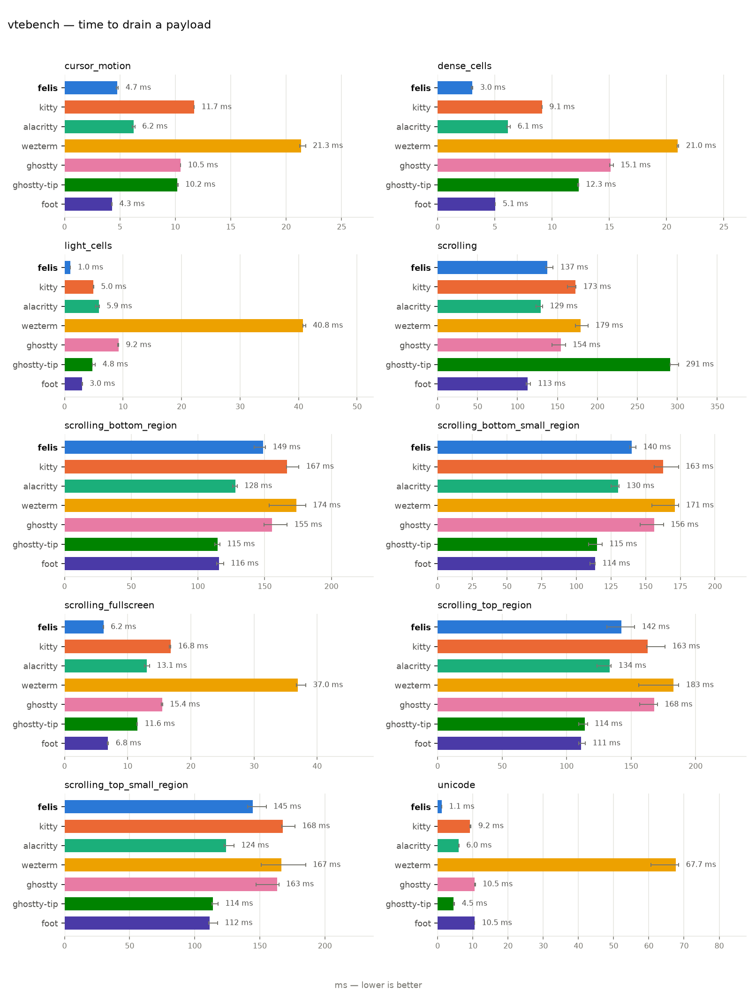

vtebench, milliseconds to drain a payload with the renderer live (lower is better):

| Benchmark                     | felis   | kitty | alacritty | wezterm | ghostty | ghostty-tip | foot    |
| ----------------------------- | ------- | ----- | --------- | ------- | ------- | ----------- | ------- |
| cursor_motion                 | 4.7     | 11.7  | 6.2       | 21.3    | 10.5    | 10.2        | **4.3** |
| dense_cells                   | **3.0** | 9.1   | 6.1       | 21.0    | 15.1    | 12.3        | 5.1     |
| light_cells                   | **1.0** | 5.0   | 5.9       | 40.8    | 9.2     | 4.8         | 3.0     |
| scrolling                     | 137     | 173   | 129       | 179     | 154     | 291         | **113** |
| scrolling_bottom_region       | 149     | 167   | 128       | 174     | 155     | **115**     | 116     |
| scrolling_bottom_small_region | 140     | 163   | 130       | 171     | 156     | 115         | **114** |
| scrolling_fullscreen          | **6.2** | 16.8  | 13.1      | 37.0    | 15.4    | 11.6        | 6.8     |
| scrolling_top_region          | 142     | 163   | 134       | 183     | 168     | 114         | **111** |
| scrolling_top_small_region    | 145     | 168   | 124       | 167     | 163     | 114         | **112** |
| unicode                       | **1.1** | 9.2   | 6.0       | 67.7    | 10.5    | 4.5         | 10.5    |

On the five scrolling rows other than scrolling_fullscreen, felis's rounds span 131 to 155 ms and foot's 110 to 119 ms,
so felis's median trails foot's by 25 to 33 ms on each of them. alacritty's range also lies below felis's on four of the
five; on scrolling_top_region the two overlap. On the region rows ghostty-tip's and foot's ranges overlap.

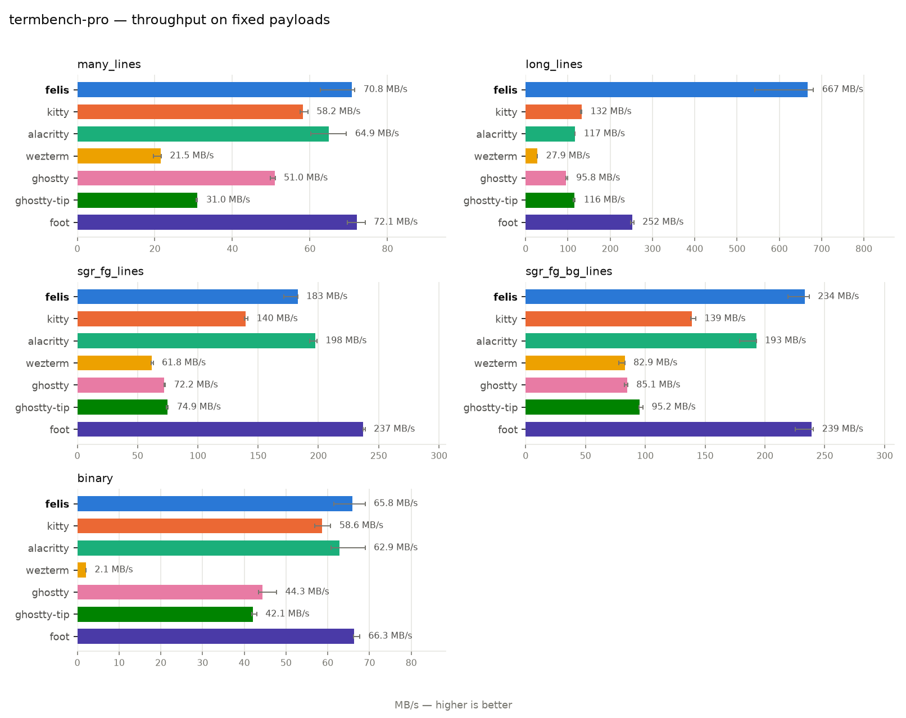

termbench-pro, MB/s (higher is better):

| Benchmark       | felis   | kitty | alacritty | wezterm | ghostty | ghostty-tip | foot     |
| --------------- | ------- | ----- | --------- | ------- | ------- | ----------- | -------- |
| many_lines      | 70.8    | 58.2  | 64.9      | 21.5    | 51.0    | 31.0        | **72.1** |
| long_lines      | **667** | 132   | 117       | 27.9    | 95.8    | 116         | 252      |
| sgr_fg_lines    | 183     | 140   | 198       | 61.8    | 72.2    | 74.9        | **237**  |
| sgr_fg_bg_lines | 234     | 139   | 193       | 82.9    | 85.1    | 95.2        | **239**  |
| binary          | 65.8    | 58.6  | 62.9      | 2.1     | 44.3    | 42.1        | **66.3** |

felis's range overlaps foot's on many_lines, sgr_fg_bg_lines and binary, so the order on those rows is not resolved. On
sgr_fg_lines both foot's and alacritty's ranges lie above felis's.

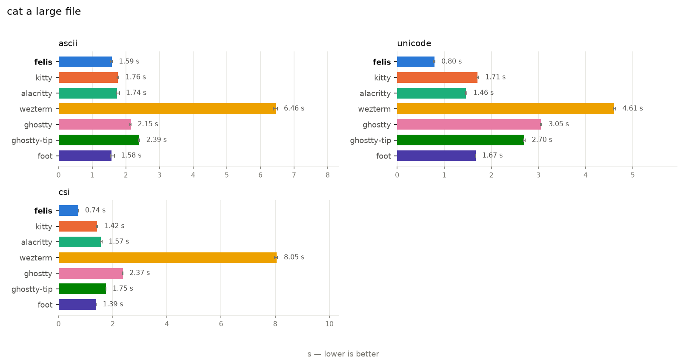

`cat` of a 150 MB file, seconds until `cat` returns (lower is better):

| Payload | felis    | kitty | alacritty | wezterm | ghostty | ghostty-tip | foot     |
| ------- | -------- | ----- | --------- | ------- | ------- | ----------- | -------- |
| ascii   | 1.59     | 1.76  | 1.74      | 6.46    | 2.15    | 2.39        | **1.58** |
| unicode | **0.80** | 1.71  | 1.46      | 4.61    | 3.05    | 2.70        | 1.67     |
| csi     | **0.74** | 1.42  | 1.57      | 8.05    | 2.37    | 1.75        | 1.39     |

On ascii the felis and foot ranges overlap.

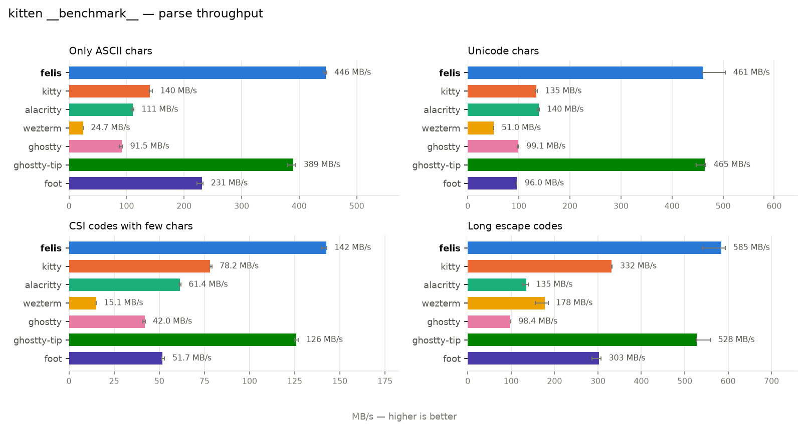

`kitten __benchmark__`, parse throughput with rendering suppressed, MB/s (higher is better):

| Benchmark                | felis   | kitty | alacritty | wezterm | ghostty | ghostty-tip | foot |
| ------------------------ | ------- | ----- | --------- | ------- | ------- | ----------- | ---- |
| Only ASCII chars         | **446** | 140   | 111       | 24.7    | 91.5    | 389         | 231  |
| Unicode chars            | 461     | 135   | 140       | 51.0    | 99.1    | **465**     | 96.0 |
| CSI codes with few chars | **142** | 78.2  | 61.4      | 15.1    | 42.0    | 126         | 51.7 |
| Long escape codes        | **585** | 332   | 135       | 178     | 98.4    | 528         | 303  |

On Unicode chars and long escape codes the felis and ghostty-tip ranges overlap.

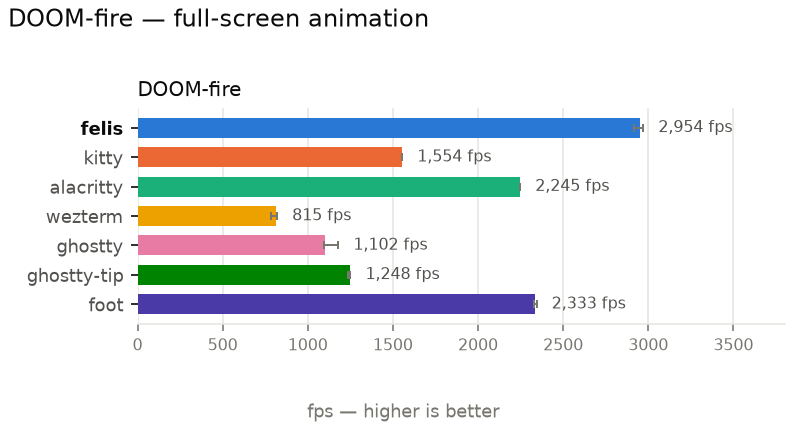

DOOM-fire, frames per second over 20 s, as counted by the program (higher is better):

| felis     | kitty | alacritty | wezterm | ghostty | ghostty-tip | foot  |
| --------- | ----- | --------- | ------- | ------- | ----------- | ----- |
| **2,954** | 1,554 | 2,245     | 815     | 1,102   | 1,248       | 2,333 |

### Latency

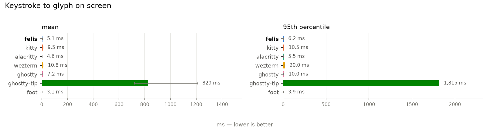

Keystroke to glyph on screen, measured with `wl-latency`, 200 keys per round, in milliseconds (lower is better). The
figures include the compositor and the display, so they compare terminals with each other and not with zero.

| Statistic       | felis | kitty | alacritty | wezterm | ghostty | ghostty-tip | foot    |
| --------------- | ----- | ----- | --------- | ------- | ------- | ----------- | ------- |
| mean            | 5.1   | 9.5   | 4.6       | 10.8    | 7.2     | 829         | **3.1** |
| 95th percentile | 6.2   | 10.5  | 5.5       | 20.0    | 10.0    | 1,815       | **3.9** |

Across the three rounds, ghostty-tip's samples ranged from 10 to 1,824 ms, against 5 to 37 ms for the 1.3.1 release.
This build often shows a typed glyph only on a later redraw, so its figures measure that redraw delay rather than its
input path.

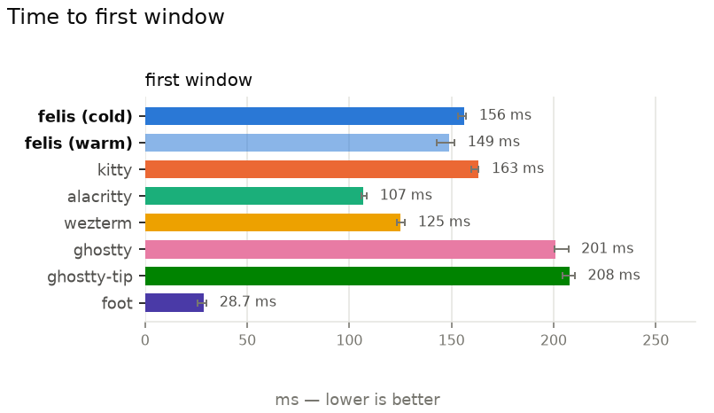

Time from launch to the first window, in milliseconds (lower is better). A window counts when niri reports it mapped
with its first buffer committed. Each round is the median of 10 launches after 3 discarded ones.

| felis (cold) | felis (warm) | kitty | alacritty | wezterm | ghostty | ghostty-tip | foot     |
| ------------ | ------------ | ----- | --------- | ------- | ------- | ----------- | -------- |
| 156          | 149          | 163   | 107       | 125     | 201     | 208         | **28.7** |

felis (cold) starts its daemon on every launch; felis (warm) reuses a running one. Warm was below cold in every round
(143 to 152 against 153 to 157).

### Memory

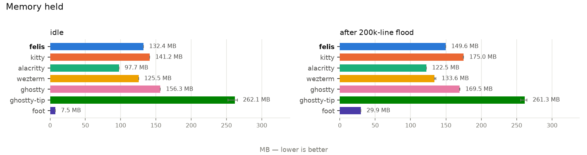

Proportional set size (PSS, `/proc/<pid>/smaps_rollup`) summed over each terminal's processes, in MB (lower is better):

| State                   | felis | kitty | alacritty | wezterm | ghostty | ghostty-tip | foot     |
| ----------------------- | ----- | ----- | --------- | ------- | ------- | ----------- | -------- |
| idle                    | 132.4 | 141.2 | 97.7      | 125.5   | 156.3   | 262.1       | **7.5**  |
| after a 200k-line flood | 149.6 | 175.0 | 122.5     | 133.6   | 169.5   | 261.3       | **29.9** |

felis's figure is client plus daemon: 126.7 MB and 5.7 MB idle, 127.5 MB and 22.0 MB after the flood. foot draws on the
CPU; the other six map the NVIDIA driver and LLVM into their processes, and that mapping is inside their figures. Every
terminal keeps 10,000 lines of scrollback except ghostty 1.3.1, which caps scrollback only by bytes and ran at its
default, so its flood row is not held to the same depth.

PSS divides each shared page among every process that maps it, including processes outside the benchmark. The GPU
terminals' figures therefore move with how many other programs on the desktop map the same driver libraries: between two
runs of the same builds on this machine, the idle figures of kitty, alacritty, wezterm and both ghostty builds moved by
44 to 58 MB while foot's moved by under 1 MB. Compare the figures within this table, not with another run.

### Resource use under load

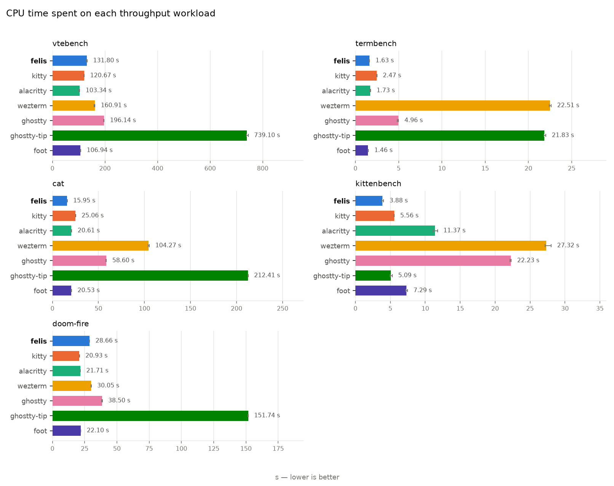

CPU time (`utime + stime`) the terminal's processes accrued over each workload's measured pass, in seconds (lower is
better). felis is its client and daemon summed.

| Workload    | felis    | kitty    | alacritty | wezterm | ghostty | ghostty-tip | foot     |
| ----------- | -------- | -------- | --------- | ------- | ------- | ----------- | -------- |
| vtebench    | 132      | 121      | **103**   | 161     | 196     | 739         | 107      |
| termbench   | 1.63     | 2.47     | 1.73      | 22.5    | 4.96    | 21.8        | **1.46** |
| cat         | **16.0** | 25.1     | 20.6      | 104     | 58.6    | 212         | 20.5     |
| kittenbench | **3.88** | 5.56     | 11.4      | 27.3    | 22.2    | 5.09        | 7.29     |
| doom-fire   | 28.7     | **20.9** | 21.7      | 30.1    | 38.5    | 152         | 22.1     |

Work that runs outside those processes is not counted. A GPU terminal's drawing is partly done by the driver's own
threads and by the GPU, while foot, which draws on the CPU, is charged for all of it. The daemon accounts for 95% or
more of felis's time in every workload. The 200k-line flood of the memory suite cost 0.07 to 0.38 s for every terminal
except ghostty-tip, which spent 2.53 s.

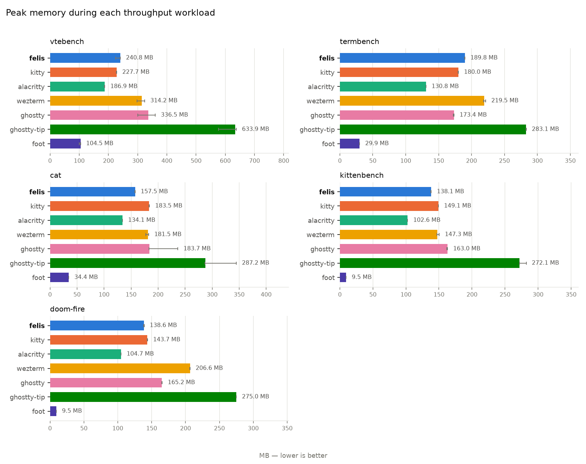

Peak PSS over each workload's measured pass, sampled every 0.25 s and summed over the terminal's processes, in MB (lower
is better). The shared-page caveat of the memory section applies.

| Workload    | felis | kitty | alacritty | wezterm | ghostty | ghostty-tip | foot      |
| ----------- | ----- | ----- | --------- | ------- | ------- | ----------- | --------- |
| vtebench    | 240.8 | 227.7 | 186.9     | 314.2   | 336.5   | 633.9       | **104.5** |
| termbench   | 189.8 | 180.0 | 130.8     | 219.5   | 173.4   | 283.1       | **29.9**  |
| cat         | 157.5 | 183.5 | 134.1     | 181.5   | 183.7   | 287.2       | **34.4**  |
| kittenbench | 138.1 | 149.1 | 102.6     | 147.3   | 163.0   | 272.1       | **9.5**   |
| doom-fire   | 138.6 | 143.7 | 104.7     | 206.6   | 165.2   | 275.0       | **9.5**   |

### Limits of this run

- Every terminal held the same 106x35 cell grid, but the render areas differ: felis draws 1167x808 px, kitty, alacritty
  and foot 1166x805, ghostty and ghostty-tip 1172x780, and wezterm 1166x770. felis renders 0.5 to 5% more pixels than
  the others at the same cell count.
